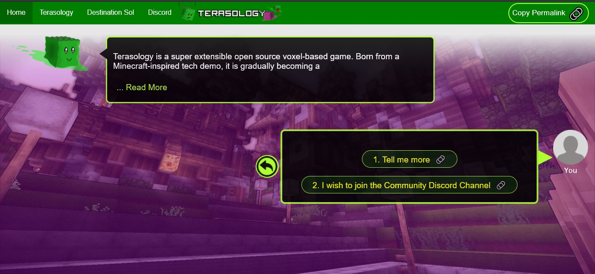

# Path Structure for the Roles -

### Paths : Stepwise resources a user follows according to the role.

## Role : The Terasology Foundation works in various fields with various tech stacks and there are a lot of ways to contribute.
- Example Roles - Player, Modder, Artist, etc.

---

## Sub-Role : Sub role is a specific type of role. (in a particular Role)
- Example Sub-Roles -  Artist Role has Sub-Roles like - 1. 2D/3D Artist 2. Sound Artists, etc.

---

## Path Structure -

- The path structure is common for roles and sub-roles.
- It is written in a JSON Schema which is wrapped in a Jsx function (similar to react).
- The roles are nested inside their parent Roles.

### Schema - 

```
{
      'user-responses': [
                            {

                            // This is a user responseObject 1
                            // Type: Intermediate Object

                              name: "This is a text message which will appear in user chat box",       
                              child: ChildRole    
                              
                            },
                            {

                            // This is a user responseObject 2
                            // Type:  Resource Object
                            
                            "name":"This is a text message which will appear in user chat box",     
                            "link": "https://example.com"                                           

                            }
                      ],

      'gooey-response': { gooey: "This line defines the gooey responce." }
}

```
## Terms used in above mentioned Schema :

**1. user-responses - [Type: JSON Array] -** This is a JSON array which holds Response-Objects.

**2. Response Object - [Type: JSON Object] -** This is a JSON Object which holds data for a response. 

**3. name - [Type: String] -** `name` JSON attribute that indicates the text which we see in user response.

**4. child - [Type: JSON Object (external)] -** `child` is a JSON attribute that acts as a call to another (sub) Role. This role is accessed when a user clicks on the response.

**5. link - [Type: String] -** It contains a link which gets opened in a new tab when a user clicks on the response. 

> Note - An Response Object must not contain child and link at the same time. i.e. It should either contain a resource link or next sub-role call.

---

# Example -

### Example Schema - 

```
{
   "user-responses":[
      {
         "name":"Tell me more",
         "link":"https://terasology.org/about.html"
      },
      {
         "name":"I wish to join the Community Discord Channel",
         "link":"https://github.com/MovingBlocks/Terasology/wiki#communication"
      }
   ],
   "gooey-response":{
      "gooey":"Terasology is a super extensible open source voxel-based game. Born from a Minecraft-inspired tech demo, it is gradually becoming a stable platform for all sorts of gameplay settings in a voxel world."
   }
   
}
```

### Output - 


